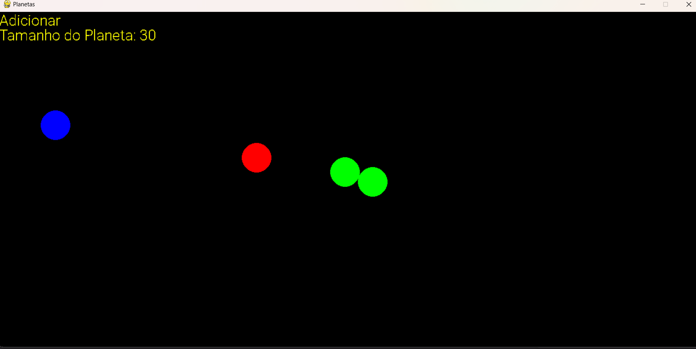
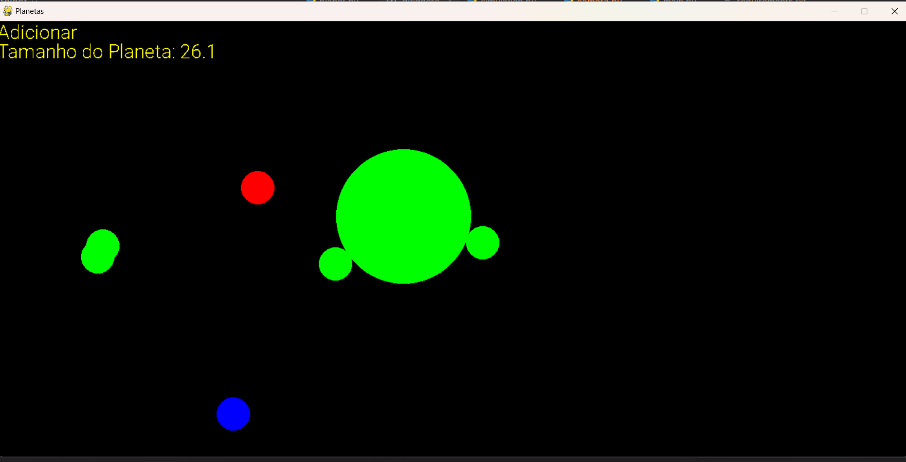
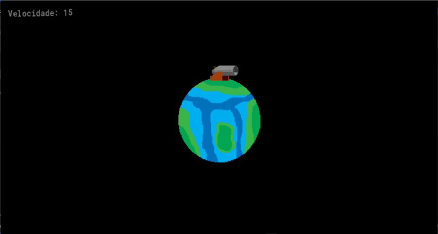
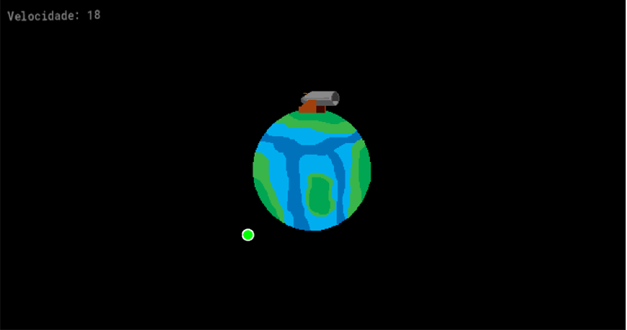

# Trabalho de Física: Simulações de Gravidade
Para mostrar a lei universal gravitacional de Newton e sua Segunda Lei, o grupo fez duas simulações.
1.	Uma mais simples, mostrando a atração gravitacional entre os objetos de iguais massas
2.	A final, um canhão de newton com velocidade controlável

## Imagens da Simulação 1

## Simulação 1: Atração entre corpos
Simulação feita para um trabalho de Física tendo como objetivo 
demonstrar as leis de Newton simulando a colisão e atração gravitacional 
entre corpos. Aqui abaixo estão 
*	Todos os corpos possuem a mesma massa
*	Todos os corpos são círculos de raio variável
*	Corpos vermelhos estão em movimento
*	Corpos verdes são os que sofreram colisão, são estáticos
*	Clique em qualquer lugar da tela para adicionar/remover corpos
*	Clique `T` para mudar de modo de “adicionar” e “remover” um corpo
*	Use as teclas `Y` e `U` para aumentar e diminuir o tamanho do corpo respectivamente
*	O círculo em azul representa o cursor

### Requisitos para Instalação
* Python 3.10+
* Pygame
* Numpy

## Imagens da Simulação 2

## Simulação 2: Canhão de Newton
Utilizando-se do GameMaker, demonstrar como a velocidade de um projétil disparado de um canhão determina
se ele cairá de volta à Terra, entrará em órbita ou escapará da atração gravitacional.
*	Clique no espaço para atirar uma bola de canhão.
*	Clique na tecla `A` para diminuir a velocidade do tiro.
*	Clique na tecla `D` para aumentar a velocidade do tiro.
*	Clique na tecla `R` para apagar todas as bolas de canhão.

### Instalação
Baixe e extraia o executável [que está aqui](./canhaoDeNewton/Simulacao2-Canhão.zip) e depois dê dois cliques em `BLANK GAME.exe`

## Licença
A licença utilizada para este projeto é a MIT, veja-a [aqui](LICENSE)

## Créditos
* **Felipe Fernandes dos Santos Oliveira** nº7 - 1ºF TECH
* E-mail: felipe.fernandes@germinare.org.br

* **Giovanne Antony Bahia Torquato** nº10 - 1ºF TECH
* E-mail: giovanne.torquato@germinare.org.br

* **Gustavo Henrique de Almeida Ferreira** nº11 - 1ºF TECH 
* E-mail: gustavo.ferreira@germinare.org.br

* Professor: **Ricardo Ivonei de Almeida**
